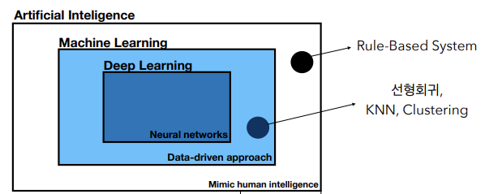
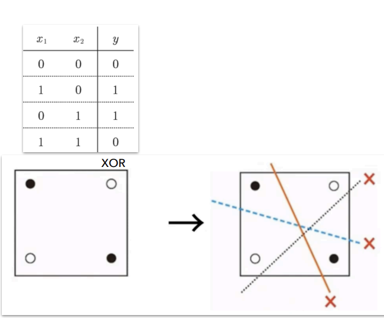
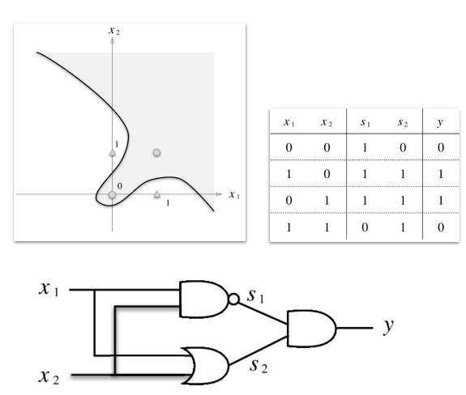

## AI-Study WIL1

### 인공지능이란?
**A**rtificial **I**ntelligence   
인간 지능과 연결된 인지 문제를 해결하는 데 주력하는 컴퓨터 공학 분야

</br>

### AI/ML/DL


**A**rtificial **I**ntelligence : 인간의 지능과 연결된 인지문제를 해결하는 알고리즘

**M**achine **L**earning : 데이터로부터 특징을 학습하는 알고리즘

**D**eep **L**earning : 신경망(Neural Network)을 기반으로 특징을 학습하는 알고리즘

</br>

### 모델이 데이터를 학습하는 방법

> #### 지도학습 (Supervised Learning)
입력 데이터와 그에 대응하는 레이블이 함께 제공되는 학습 방법

> #### 비지도학습 (Unsupervised Learning)
레이블이 없는 데이터를 학습    
-> 데이터의 내재된 구조를 학습하는 데 집중

> #### 준지도학습 (Semi-supervised Learning)
소량의 고품질 레이블 데이터 + 대량의 레이블이 없는 데이터 학습

> #### 자가지도학습 (Self-supervised Learning)
레이블이 없는 데이터에서 자동으로 지도 신호를 생성하여 학습

</br>

### DL의 요소
- Data   
    : 학습 데이터, 검증 데이터, 테스트 데이터   
    : 모델의 성능을 좌우함

- Model

- Loss Function   
    : 학습 중 알고리즘이 얼만큼 잘못 예측하는 지에 대한 지표

</br>

### 퍼셉트론
이진 분류 모델을 학습하기 위한 지도학습 기반의 알고리즘으로, 오류를 최소화하는 방향으로 학습

```
두 그룹을 가장 잘 나누는 decision boundary(w, b) 를 찾음   
-> weight(w)와 bias(b)를 무작위 값으로 설정   
-> 데이터를 하나씩 학습하면서 w와 b를 업데이트
```
> #### 단층 퍼셉트론
선을 그어 class를 구분하는 알고리즘    
-> 선을 그어 구분하므로 XOR 문제를 해결할 수 없음  
-> 복잡한 패턴을 학습하는 데 한계 존재    

> #### 다층 퍼셉트론
단층 퍼셉트론의 한계를 층을 늘리는 것으로 해결

 


왼쪽: 단층 퍼셉트론 / 오른쪽: 다층 퍼셉트론

</br>

### 인공신경망
**A**rtificial **N**eural **N**etwork   
입력 데이터와 출력 데이터의 관례를 학습하고 모델링하는 알고리즘 

</br>

### 순전파와 역전파

> #### 순전파 (Feedforward)
입력 데이터를 네트워크의 각 층을 거쳐 출력층까지 전달하는 과정으로, 각 층의 노드는 입력 값을 가중치와 함께 처리하고 활성화 함수를 통해 출력 값을 다음 층으로 전달함

> #### 역전파 (Backpropagation) 
예측 결과와 실제 값의 오차를 계산한 후, 그 오차를 네트워크의 가중치로 다시 전달하며 가중치를 수정하는 과정
