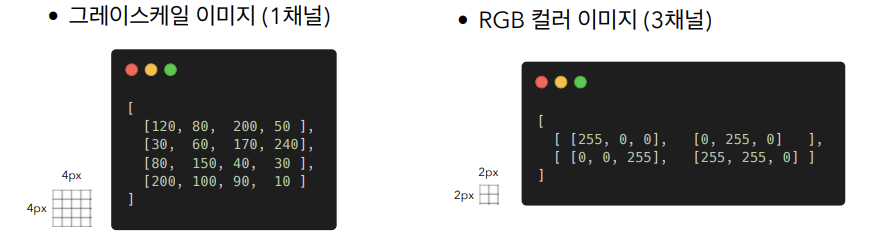
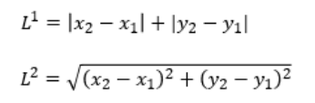
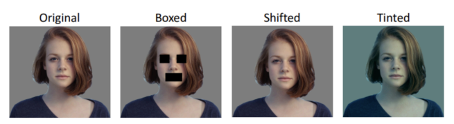
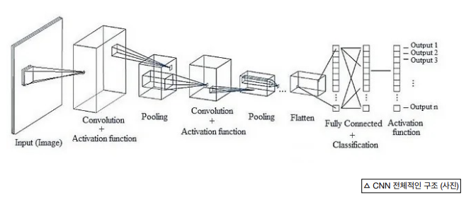
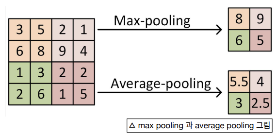
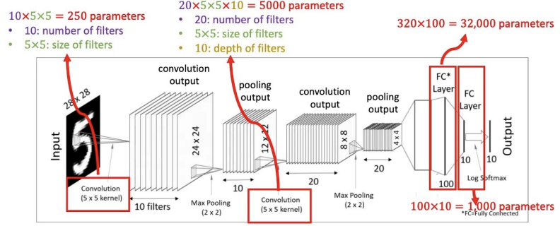

## AI-Study WIL3

### Image Classification
컴퓨터가 주어진 이미지를 **보고** 이미지가 어떤 카테고리에 속하는지 **판단**

_Image classification이라고 다 지도학습은 아니다!_

</br>

### 이미지 데이터의 구조
> Pixel(픽셀), Channel(채널), Resolution(해상도)

컴퓨터는 이미지를 숫자의 배열, 행렬로 인식



</br>

### 이미지 분류 접근 방식
1. Raw-pixel을 이용한 비교  
    : 이미지의 픽셀 값을 직접 비교하여 유사성 판단   
    -> 좋은 방법은 아님

2. 두 이미지의 차이 측정
    - L1 Distance: Manhattan Distance -> 좌표에 dependent
    - L2 Distance: Euclidean Distance -> 좌표에 independent

        

</br>

### Linear Classifier(선형분류기)

> f(x, W) = Wx + b    
> x: 이미지의 픽셀들을 flatten 시킨 입력     
> W: Weight Parameter, (클래스 개수) * (입력 데이터의 크기)    
> b: Bias, (클래스 개수) * 1, 독립적인 값   

- 훈련 데이터에 대한 지식을 요약하여 가중치에 집어넣음
- 가중치 행렬과 이미지 행렬의 계산으로 템플릿과 이미지 픽셀 사이의 유사성에 대한 점수를 매김

    
    
    -> 픽셀을 기준으로 차이를 비교하므로 위의 사진들을 구분하지 못한다!

- 하나의 선형분류기만 이용하면 템플릿이 하나로만 요약됨

    -> 다양한 블록들이 필요함

</br>

### 이미지 분류의 Challenge
- 시점 차이
- 조명 변화
- 형태의 변화(다른 포즈 등)
- 일부 가려짐

-> _이러한 다양한 데이터셋에서도 분류할 수 있는 Robust 분류기를 만들어야 함_

</br>

### **C**onvolutional **N**eural **N**etwork(CNN, 합성곱 신경망)
> Convolutional Layer, Pooling Layer, Fully Connected Layer로 구성됨

이미지의 2차원 구조를 그대로 유지하면서 분석



-> 필터를 사용해서 feature map을 얻음

</br>

```
! Fully-connected multi layered Neural Network(FNN)
- 입력 데이터를 1차원으로 펼쳐서 처리
- 인접 픽셀간의 상관관계가 무시되어 이미지를 벡터화하는 과정에서 정보손실이 발생함
```

</br>

`Convolutional Layer` : 입력 이미지에 다양한 필터를 적용하여 특징을 추출함
(각 필터는 특정 패턴을 감지하도록 학습)

A Convolutional Layer = **convolution** + activation

</br>

`Pooling Layer` : Feature map의 크기를 줄이면서 특정 영역에서 가장 강한 특징만을 선택

- max pooling: 영역에서 가장 큰 값 선택
- average pooling: 영역의 평균값 계산

    

</br>

`Fully Connected Layer` : 이전 층의 모든 뉴런과 연결되어 추출된 특징들을 종합하여 최종 분류를 수행

---



-> Convolution Layer와 Pooling Layer가 반복된다!
