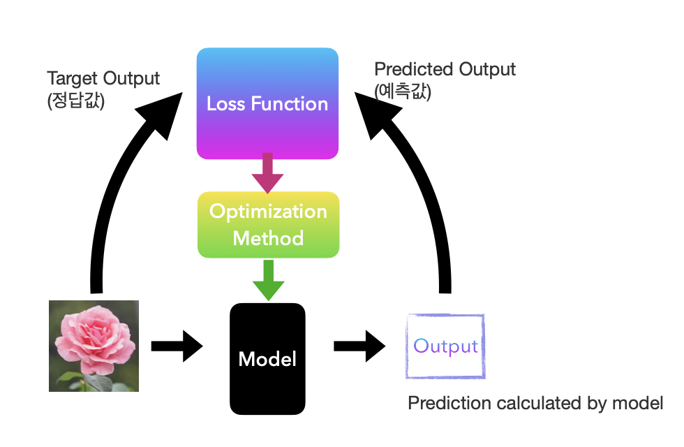
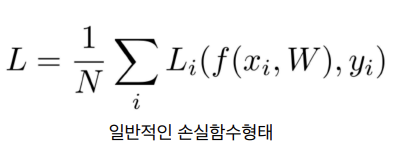

## AI-Study WIL4



### Loss Function

`Weight Matrix`
- 목적: 입력 이미지를 정확하게 분류
- 최적화 방법 -> 분류 정확도 최대화
    - Loss Function을 사용하여 현재 Weight Matrix의 **예측과 실제 정답 간의 차이(오차 정도)** 를 수치화

        

    - 측정 결과를 바탕으로 Weight Matrix 값 업데이트

```
문제의 특성과 데이터 유형에 따라 적합한 Loss Function을 선택해야 한다!

회귀 문제: MSE(Mean Squared Error)
분류 문제: SVM Loss(Support Vector Machine), Cross-Entropy Loss
```

`Mean Squared Error` : 연속형 변수를 예측할 때 사용

`SVM` : 분류 경계에 가장 가까운 데이터 포인트들을 이용해 최적의 결정 경계를 찾는 알고리즘

- Support Vector: 결정 경계와 인접한 데이터 포인트
- Margin: 결정 경계를 기반으로 Support Vector까지의 거리

    -> SVM은 허용 가능한 **오류 범위** 내에서 최대 margin을 만드는 것을 목표로 함

`Cross-Entropy Loss` : 네트워크 출력을 **확률**로 해석, 잘한 예측에는 작은 페널티를 부과하고 잘못된 예측에는 큰 페널티를 부과

</br>

### Regularization

모델의 복잡도를 제어하고 과적합을 방지

```
Overfitting: 모델이 훈련 데이터에 너무 가깝게 맞춰져 새 데이터에 어떻게 대응해야 할지 모르는 경우
```

`L2 Regularization` : 매끄러운 그래프를 원할 때 쓰는 정규화
- 큰 가중치에 더 큰 페널티를 부과하여 극단적인 가중치를 피하고 모든 특성이 적당히 기여하도록 유도함


`L1 Regularization` : 분류기가 복잡하다고 느껴질 때 쓰는 정규화
 - 가중치 값에 0이 많도록 하여 보다 더 단순한 식을 만듦

</br>

### Optimization

Loss Function이 줄어들도록 조정하는 방법

`Gradient Descent(경사하강법)` : 가장 가파른 방향으로 이동하며 최소값을 갖는 지점을 찾는 방법

- _Local Minimum_ 문제 존재, 최소값으로 찾은 지점이 전체에서 봤을 때는 최소가 아닐 수 있다!
    - `Momentum(관성)`: 이전 단계의 업데이트 방향을 고려하여 현재 업데이트에 반영
    - `Adaptive Learning rate`: 과거의 그래디언트 정보를 활용하여 각 파라미터마다 서로 다른 학습률 적용

