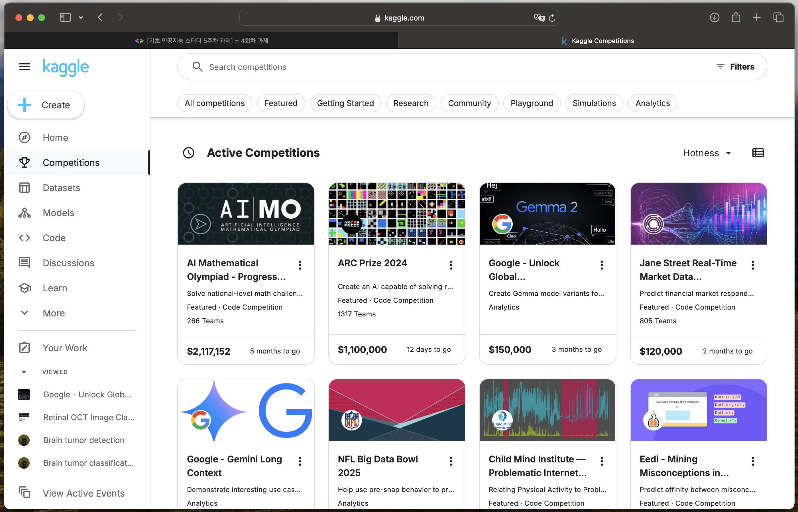
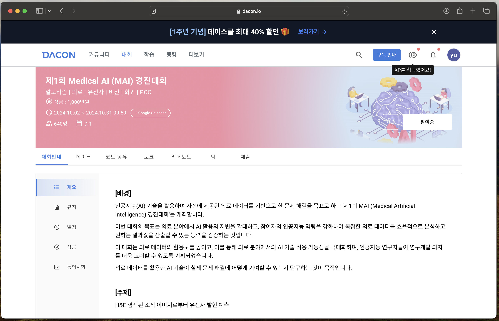

## AI-Study Search_Review

요즘 기계학습기초 프로젝트를 하느라 캐글에서 이것저것 데이터셋을 찾아보고 있었어용
https://www.kaggle.com/datasets/obulisainaren/retinal-oct-c8

캐글에 들어가보니 대회가 이것저것 꽤 많았지만,,, 아직 감자라,,, 프로젝트를 하며 감자를 탈출해보도록 노력한 다음 다시 흥미가 있는 대회를 찾아보려구 합니당

     
    

