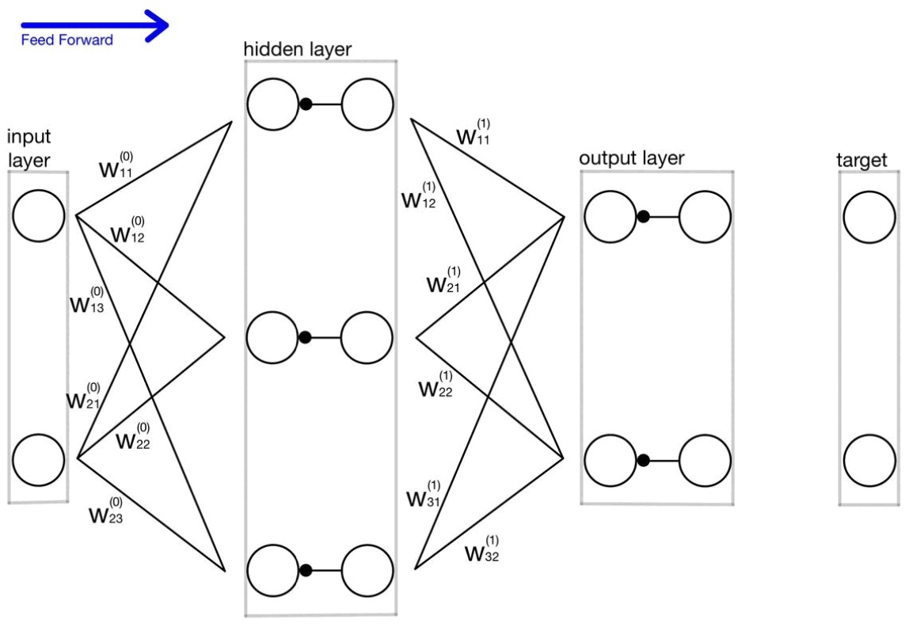
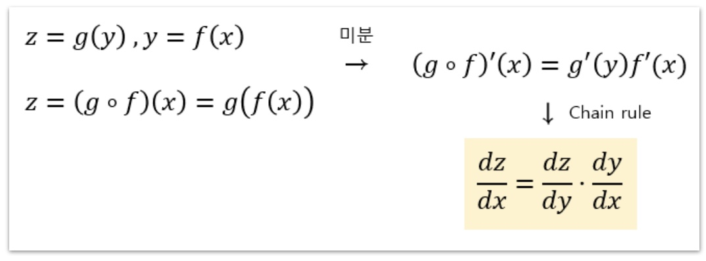
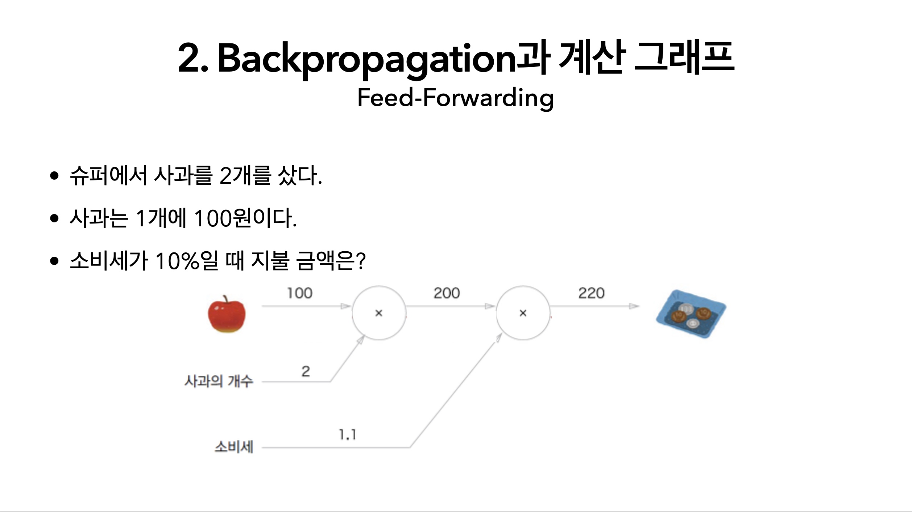
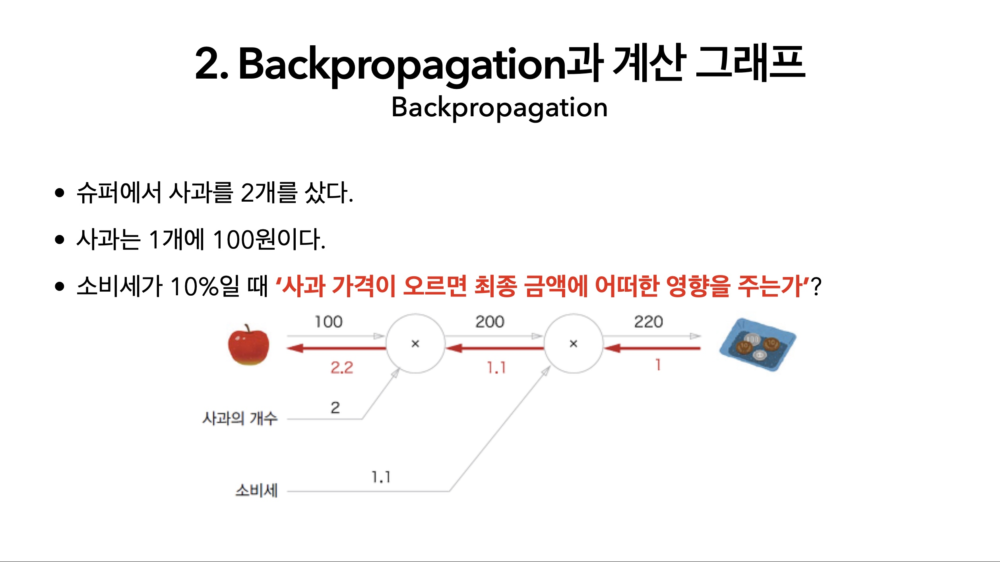
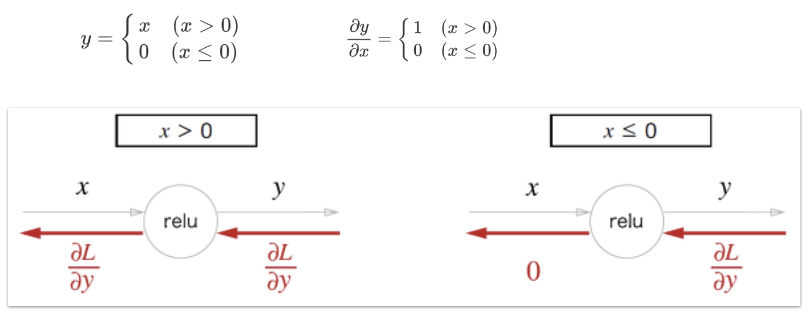
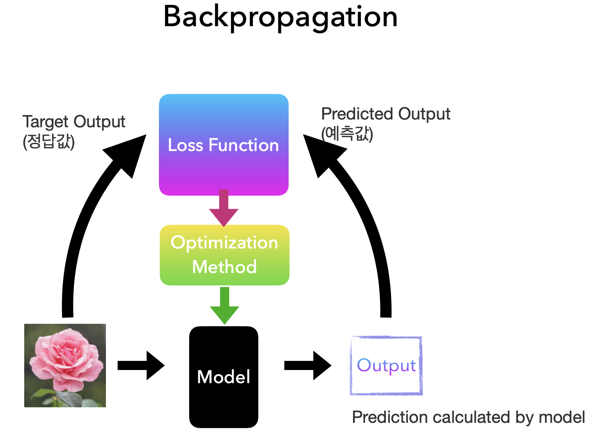

## AI-Study WIL4

### Backpropagation
> **Artificial Neural Network**를 학습시키기 위한 알고리즘   
> target값과 output 사이의 차이를 구하고 **오차값을 다시 뒤로 전파**해가면서 **각 노드가 가지고 있는 변수들을 갱신**



- 입력 데이터가 신경망을 통해 출력으로 변환되어 손실 함수 값 계산 (=순전파 1번)
- 손실 함수의 기울기를 각 가중치에 대해 한 번의 역전팍로 계산
    - Chain Rule을 이용하여 모든 가중치의 기울기를 동시에 구할 수 있음

```
Back propatation이 없다면? -> n개의 가중치가 있다면 손실함수의 출력을 n번 계산해야 함
```

</br>

### Chain Rule(미분 연쇄 법칙)
z함수를 x에 대해 미분한 결과 =  z함수를 y에 대해 미분한 결과 * y함수를 x에 대해 미분한 결과



</br>

### Feed-forwarding vs Backpropagation

<div style='display:flex;'>
     
    
</div>

</br>

### 계산 그래프
활성화 함수 없이 여러 층을 쌓는다면?   
``` f(x) = W2(W1x + b1) + b2 -> f(x) = Wx + b ```

활성화 함수 없이 여러 층을 쌓아도 **결국은 하나의 선형 변환으로 축소됨**   
-> `비선형 활성화 함수`는 각 층에서 더 복잡하고 추상적인 특징을 학습할 수 있게 해줌

</br>

### ReLU 계층에서 Backpropagation



</br>

---

### Summary
Backpropagation: `파라미터 x값이 오르면 최종 Loss에 어떠한 영향을 주는가`를 미분값을 통해 계산할 수 있음 



> Backpropagation -> Optimization Method에서 적용됨

`Loss Function`으로 정답과 예측에 대한 loss를 구해서 `Optimization Method`에 전달   
-> 기울기를 구해서 각각의 파라미터들에 대한 업데이트 진행

#### 신경망에서 어떻게 Backpropagation이 진행되는가
1. 데이터 입력 -> 데이터가 모델로 감
2. 순전파 -> output값이 만들어짐
3. 손실 계산: Loss Function
4. 역전파: Optimization Method -> 최적화된(업데이트 시킨) Weight Parameter값을 모델에 끼워서 다음 epoch부터 다시 진행

1-4 과정 반복
