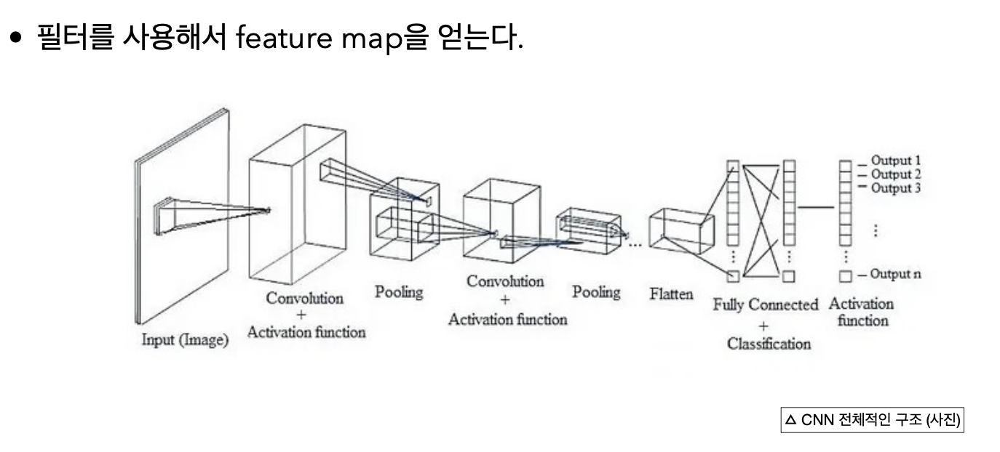
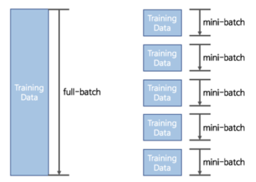
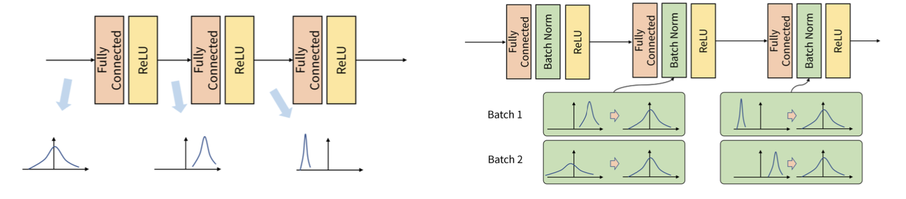
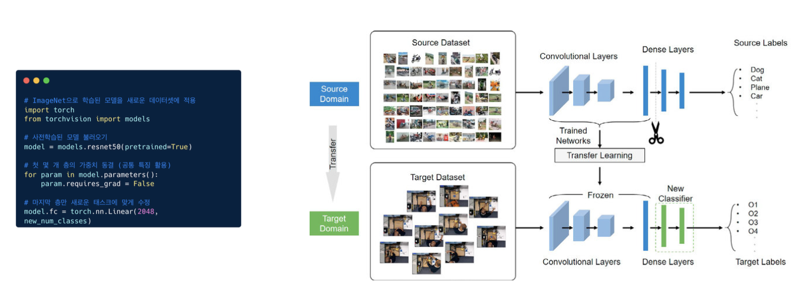
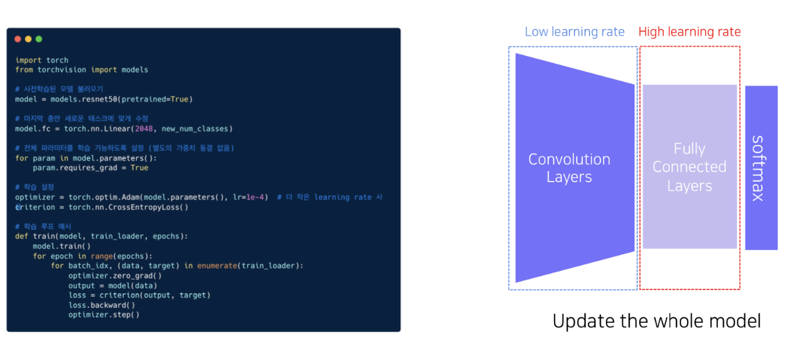
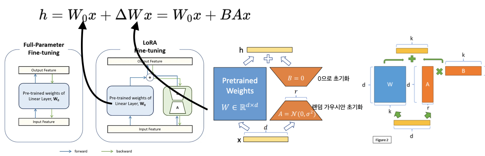

## AI-Study WIL6

### CNN: **C**onvolutional **N**eural **N**etwork

 

### Activation Function (활성화 함수)
**비선형 활성화 함수**는 각 층에서 더 복잡하고 추상적인 특징을 학습할 수 있게 함

 

### Batch Normalization 
- 정규화 없이는 큰 스케일을 가진 특성이 모델에 과도하게 영향을 미칠 수 있음
- 학습 속도 향상

 

`Mini-Batch` : 전체 Dataset이 아닌 현재 미니배치 내의 데이터에만 집중

_일반적으로 32 ~ 256 개의 데이터를 1 batch size로 사용_

#### 왜 나눠서 할까?
이미지와 같이 크기가 큰 데이터셋을 전체 메모리에 올려서 학습을 시키는 것은 비효율적임    
-> 여러 개의 GPU server에 나눠서 loss를 구하고 batch normalization을 적용시킴    
-> 효율적인 계산 가능!!

`Internal Covariant Shift` : Batch 단위로 학습을 할 때 학습 과정에서 계층 별로 입력의 데이터 분포가 달라지는 현상

Batch 단위 간에 데이터 분포의 차이가 발생하므로 사이사이에 batch normalization을 적용시킨다

 

### Transfer Learning
Data가 많이 없을 때 쓸 수 있는 방법

> 비슷한 데이터셋은 공통적인 정보를 갖고 있다    
> -> 이미 쌓아놨던 dataset들을 학습시켰던 모델의 가중치를 그대로 학습시키고자 하는 task에 그대로 적용시키는 것

- 데이터가 정말 얼마 없을 때 마지막 부분만 바꿔주는 방법

    

    `param.requires_grad = False` : 처음 부분들은 더 이상 학습하지 않겠다!

- 데이터가 조금은 있을 때 쓰는 방법
    - 새롭게 만든 task에 맞게 Fully Connected Layers를 붙여주고 Learning Rate를 크게 설정
    - Convolution Layers는 overfitting을 방지하기 위해 learning rate를 낮게 설정

    

    위에서 False로 두어 학습시키지 않겠다고 한 부분도 학습을 시킴

    `Parameter-Efficient Fine-Tuning with Low-Rank Adaptation (LoRA)`    
    : 원래의 가중치와 합쳐서 새로운 가중치를 만들어 냄

    

 

### Knowledge Distillation (지식전이)
작은 모델을 쓰고 싶은데 괜찮은 성능을 얻고 싶을 때 쓰는 방법    
-> _다른 클래스와의 관계도 학습한다!_

