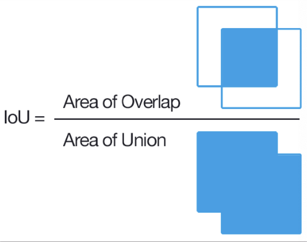
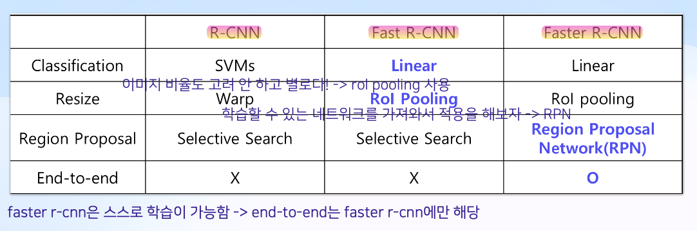

## AI-Study WIL7

### Object Detection
: 어떤 객체가 어느 위치에 있는지를 파악하는 Task

-> Image Classification의 확장

 

### 2-Stage Detector

- R-CNN
- Fast R-CNN
- RPN

> `NMS` : Non-Max Suppression -> 여러 개의 bounding box를 제일 정확해 보이는 하나로 줄여줌   
> 1. 가장 높은 score 을 가진 박스 선택
> 2. 나머지 score을 가진 박스들과 IOU를 비교하여 threshold 이상의 IOU를 가진 박스들을 제거
> 3. 1, 2 반복
> 
>`IOU` : Intersection over Union 
> IOU가 1에 가깝다 = 같은 object를 가리키고 있을 확률이 높다
>
> 

### R-CNN : Region-Based CNN
1. Selective Search로 ROI(Region of Interest, 객체가 있을 것 같은 지역)를 뽑음
2. Region Size Process: 고정된 크기로 warping하여 똑같은 사이즈로 만듦
3. Compute CNN features
4. Linear SVM(Support Vector Machine)으로 classify + Bbox regression

-> ROI를 2000개 가량 뽑아내야 함: expensive

### Fast R-CNN : CNN을 한 번만 연산하자
- CNN과 Resize 순서를 바꾸어 속도를 개선
    - 2000번 연산해야 하는 걸 1번으로 줄임
- Classification으로 SVM -> Linear Classification

### R-CNN vs Fast R-CNN
- R-CNN
    Region Projection -> Warping -> ConvNet

- Fast R-CNN
    ConvNet -> Region Projection -> Feature map 뽑음 -> **ROI Pooling** -> Class & Box 뽑아냄

> `ROI Pooling` : Region of Interest Pooling
> warping을 하면 원본 정보가 손실되므로 등장
> `Selective Search`
> 픽셀들과 RGB 값을 비교한 값들을 이웃으로 묶음 -> 반복
> _계산으로 나오는 부분이므로 학습시킨 부분이 없음_

### RPN: 학습할 수 있는 알고리즘
앵커박스 안에 객체를 포함하고 있는지 아닌지를 판단

### 2-Stage Detector Summary

